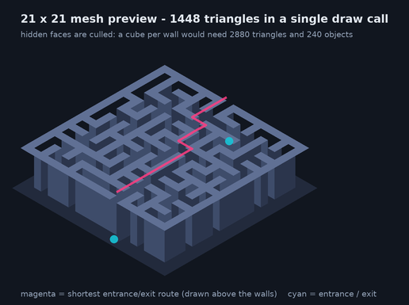

# Getting started

## Requirements

| Requirement | Version |
| --- | --- |
| Unity | 2021.3 LTS or newer (the project ships with 2021.3.21f1) |
| Render pipeline | Built-in (default). URP and HDRP also work - see [Troubleshooting](Troubleshooting.md) |
| Input | The legacy Input Manager (the project setting `activeInputHandler` is `0`) |
| Optional (tools only) | Python 3.8+ for the reference implementation, `pillow` for the diagrams |

No packages have to be installed: the runtime code only uses `UnityEngine` and `UnityEngine.UI`
is not required either - the HUD is drawn with IMGUI at runtime.

## Open the project

1. Open Unity Hub and choose **Add → Add project from disk**, then select this repository.
2. Open the project with Unity 2021.3.x (or let a newer version upgrade it).
3. Open `Assets/Scenes/Demo.unity` (it is already in **File → Build Settings**).
4. Press **Play**.

You should see a randomly generated maze with a HUD in the top left, a minimap in the top right
and a first person camera behind a capsule player standing at the entrance.



## Controls

| Input | Action |
| --- | --- |
| `W A S D` / arrow keys | Walk |
| `Shift` | Sprint |
| `Space` | Jump |
| Mouse | Look around (click to lock the cursor) |
| `P` | Show / hide the solution path |
| `1` / `2` / `3` | First person / orbit camera / free fly camera |
| `R` | Generate a new random maze |
| `F1` | Show / hide the HUD panels |
| `Tab` | Show / hide the statistics panel |
| `M` | Show / hide the minimap |
| Mouse wheel | Zoom the orbit camera, change the fly speed |
| Right mouse drag | Look around in the free fly camera |

## Generate a maze in your own scene

### From the editor

1. **GameObject → Maze → Maze Generator** creates a generator object.
2. Assign a wall prefab (the bundled `Assets/Prefabs/Wall.prefab` is a 5 unit cube) or leave it
   empty - mesh mode does not need a prefab.
3. In the inspector press **Generate**. Generation also works in edit mode, so you can preview the
   maze directly in the scene view.
4. Press **Play**: `Generate on Start` builds a fresh maze.

**GameObject → Create Demo Rig** builds the complete demo (generator, player, camera, HUD, minimap,
solution path, light and ground) in the current scene in one step.

### From script

```csharp
using Maze;
using Maze.Core;
using Maze.Generation;
using UnityEngine;

public class MyMazeUser : MonoBehaviour
{
    [SerializeField] private MazeGenerator _generator;

    private void Start()
    {
        // Configure the generator, then build.
        MazeGeneratorSettings settings = _generator.Settings;
        settings.MazeWidth = 31;
        settings.MazeHeight = 31;
        settings.Algorithm = MazeAlgorithmKind.DepthFirst;
        settings.BraidFactor = 0.3f;                       // remove a third of the dead ends
        settings.OpeningMode = MazeOpeningMode.FixedEntranceAndExit;

        MazeResult result = _generator.GenerateWithSeed(20240517);

        Debug.Log($"Seed {result.Statistics.Seed}: {result.Statistics.RoomCount} rooms, " +
                  $"{result.Statistics.DeadEndCount} dead ends, " +
                  $"{result.MeshData.TriangleCount} triangles");

        // The player can be placed at the entrance of the maze:
        Vector3 spawn = _generator.transform.TransformPoint(result.SpawnPosition);
        // ... or ask the generator whether a world position is walkable:
        bool walkable = _generator.IsWalkable(transform.position);
    }
}
```

### Without any scene objects

The core is engine independent and can be used from tests, editor tools or a batch process:

```csharp
using Maze.Core;
using Maze.Generation;

MazeGeneratorCore core = new MazeGeneratorCore();
MazeGenerationOutput output = core.Generate(new MazeGeneratorSettings
{
    MazeWidth = 101,
    MazeHeight = 101,
    Algorithm = MazeAlgorithmKind.RandomizedKruskal,
    BraidFactor = 0f,
}, seed: 1234);

MazeGrid grid = output.Grid;                       // pure logical model
string ascii = grid.ToAscii();                     // render it as text
ulong fingerprint = grid.ComputeFingerprint();     // deterministic maze identity
```

## Build the demo

1. **File → Build Settings**: `Assets/Scenes/Demo.unity` is already listed and enabled.
2. Choose a target platform and press **Build**.
3. The first scene is the HUD itself; the `MazeReader` examples in
   [API.md](API.md#examples) show how to wire your own gameplay on top.

Nothing in the demo depends on the editor, so a build behaves exactly like the editor play mode.
