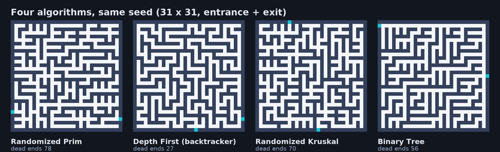
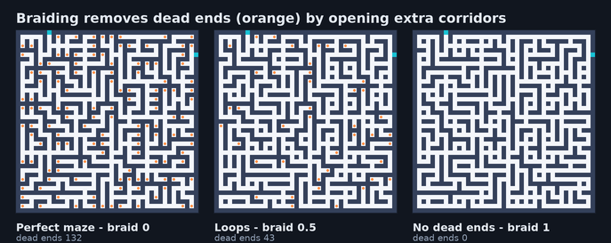
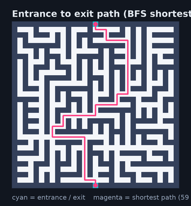

# Maze Random Generator (Unity)

A production-ready random maze generator for Unity: four algorithms, deterministic seeds, entrances
and exits, loops (braiding), a single-mesh renderer, path finding, a minimap, a first person demo and
a full test suite - all without a single package dependency.


> **Originally** a single `MazeGenerator.cs` script that placed one cube per wall cell using a
> modified Prim's algorithm. This version keeps the idea and turns it into a documented, tested and
> configurable generator (`Core`, `Algorithms`, `Generation`, `Analysis`, `Rendering`, `Gameplay`,
> `Presentation`, `UI`). See [Docs/Changelog.md](Docs/Changelog.md) for the complete list of fixes
> and features.

## Features

* **Four algorithms** - Randomized Prim, Depth First (recursive backtracker), Randomized Kruskal,
  Binary Tree - interchangeable through `IMazeAlgorithm` + `MazeAlgorithmRegistry`.
* **Deterministic seeds** - a seed always produces the same maze, on every machine and platform
  (custom xorshift128 RNG, no `UnityEngine.Random` in the generator).
* **Entrances and exits** - sealed, random or fixed entrance/exit sides; the original project could
  not open the maze at all.
* **Braiding** - remove a fraction of the dead ends to create loops and easier mazes.
* **Single mesh rendering** - hidden faces culled, floor submesh, 16/32 bit index buffers,
  **one draw call** instead of one per wall. Prefab mode is still available and pooled.
* **Path finding & minimap** - BFS solution path with a `LineRenderer`, top-down minimap rendered
  into a `RenderTexture` on its own layer.
* **Playable demo** - first person player (walk/sprint/jump/head bob), orbit and free fly cameras,
  runtime HUD with statistics and authoring controls, objective tracking ("reach the exit").
* **Statistics** - walls, passages, corridors, dead ends, junctions, depth, solution length,
  perfection and connectivity, live in the HUD and in the inspector.
* **Export / import** - versioned JSON documents (settings + grid + statistics), ASCII art,
  PNG preview, seed sharing.
* **Editor tooling** - rewritten inspector with preview generation, scene view highlighting,
  one click demo rig (`GameObject → Create Demo Rig`), batch validation of all algorithms.
* **Tested** - Unity EditMode NUnit suite plus a dependency-free Python reference implementation with
  658 invariant checks (`Tools/Reference/verify_maze_reference.py`).



## Quick start

1. Add the folder to Unity Hub (Unity **2021.3 LTS** or newer, built-in render pipeline).
2. Open `Assets/Scenes/Demo.unity` and press **Play**.

| Input | Action |
| --- | --- |
| `W A S D` | Walk |
| `Shift` / `Space` | Sprint / jump |
| Mouse | Look (click to lock the cursor) |
| `P` | Solution path |
| `1` / `2` / `3` | First person / orbit / free fly camera |
| `R` | New random maze |
| `F1` / `Tab` / `M` | Panels / statistics / minimap |

### Use it in your own scene

```csharp
using Maze;
using Maze.Core;

MazeGenerator generator = GetComponent<MazeGenerator>();
generator.Settings.Algorithm = MazeAlgorithmKind.DepthFirst;   // winding corridors
generator.Settings.BraidFactor = 0.3f;                         // remove 30 % of the dead ends
generator.Settings.OpeningMode = MazeOpeningMode.FixedEntranceAndExit;

MazeResult result = generator.GenerateWithSeed(20240517);
Debug.Log($"seed {result.Statistics.Seed}: {result.Statistics.DeadEndCount} dead ends, " +
          $"{result.MeshData.TriangleCount} triangles in {result.GenerationMilliseconds:0.0} ms");

// result.SpawnPosition / ExitPosition / SolutionPath / Grid / Statistics are ready to use.
```

Or without any scene objects at all (the core is plain C#):

```csharp
using Maze.Core;
using Maze.Generation;

MazeGenerationOutput output = new MazeGeneratorCore().Generate(
    new MazeGeneratorSettings { MazeWidth = 101, MazeHeight = 101 }, seed: 1234);
string ascii = output.Grid.ToAscii();
```

Full walkthrough: [Docs/GettingStarted.md](Docs/GettingStarted.md).

## Rendering modes

| Mode | What it creates | Draw calls (21×21) | Triangles |
| --- | --- | --- | --- |
| `Mesh` (default) | one mesh + optional floor, one mesh collider | 1 | 1 452 vs 2 904 (cube per wall) |
| `Prefabs` | one wall prefab instance per wall cell, pooled | 242 | 2 904 |

Mesh mode is an order of magnitude cheaper for large mazes (31 752 wall cells in a 251×251 maze:
1 draw call vs 31 752). Details and measurements: [Docs/Performance.md](Docs/Performance.md).

## Braiding

Dead ends can be removed progressively - `0` keeps a perfect maze, `1` creates a loop rich maze
without dead ends:



## Solution path



## Project layout

```
Assets/Code/
├── Scripts/           runtime assembly (Maze.Runtime)
│   ├── MazeGenerator.cs   facade component + settings
│   ├── Core/              grid model, settings, deterministic RNG, directions
│   ├── Algorithms/        Prim, DFS, Kruskal, Binary Tree + registry
│   ├── Generation/        pipeline, openings, braiding, baking, statistics
│   ├── Analysis/          BFS path finding, connectivity, dead ends, junctions
│   ├── Rendering/         mesh builder, palettes, material factory
│   ├── Gameplay/          player controller, objective tracker, input gateway
│   ├── Presentation/      camera rig, minimap, solution path renderer
│   ├── UI/                runtime HUD (IMGUI)
│   └── Tools/             ASCII and JSON export
├── Editor/            editor assembly (Maze.Editor): inspector, menus, scene builder
└── Tests/EditMode/    NUnit tests (Maze.Tests.EditMode)
Tools/Reference/       Python reference implementation, verifier, benchmark, doc images, C# lint
Docs/                  Documentation and generated diagrams
```

## Documentation

| Document | Content |
| --- | --- |
| [Getting Started](Docs/GettingStarted.md) | Install, demo, controls, own scenes, builds |
| [Architecture](Docs/Architecture.md) | Design, pipeline, folder map, extension points |
| [Algorithms](Docs/Algorithms.md) | The four algorithms, openings, braiding, theory |
| [Configuration](Docs/Configuration.md) | Every setting with defaults and effects |
| [API](Docs/API.md) | Components, core types, tools, editor menus, examples |
| [Performance](Docs/Performance.md) | Measured numbers, complexity, guidance |
| [Testing](Docs/Testing.md) | Test suites, reference verifier, CI |
| [Troubleshooting](Docs/Troubleshooting.md) | Pink materials, input system, minimap, ... |
| [Contributing](Docs/Contributing.md) | Style, adding an algorithm, PR checklist |
| [Changelog](Docs/Changelog.md) | Fixes and features compared to the original |

## Requirements and limitations

* Unity **2021.3 LTS** or newer; built-in render pipeline by default (URP/HDRP are supported through
  runtime shader detection or explicit material overrides).
* The legacy **Input Manager** is used (`Project Settings → Player → Active Input Handling`).
  Switching to the new Input System package requires adapting `MazePlayerController` and
  `MazeCameraRig`.
* Grid sizes are clamped to an odd interior between 5 and 501 cells per side (the room lattice
  requires odd dimensions).
* Generation runs on the main thread; huge mazes (> 300×300) should generate the `MazeGrid` off the
  main thread and apply the mesh afterwards.
* Modes: mesh (recommended) and prefab mode. Per-wall objects with individual materials are not
  supported out of the box.

## Testing

```bash
python3 Tools/Reference/verify_maze_reference.py      # 658 invariant checks (no Unity needed)
python3 Tools/Reference/benchmark_reference.py        # performance tables
node Tools/Reference/lint_csharp.mjs Assets/Code      # C# syntax check (optional, node)
```

In Unity: **Window → General → Test Runner → EditMode → Run All**, and
**Tools → Maze → Validate Generator (all algorithms)**.

## Third party assets

`Assets/Thirdparty/Ciathyza/Gridbox Prototype Materials` are textures and **Standard** (built-in
pipeline) materials from the Unity Asset Store package
[Gridbox Prototype Materials](https://assetstore.unity.com/packages/2d/textures-materials/gridbox-prototype-materials-129127)
by Ciathyza, included so the demo looks the same out of the box. The URP/HDRP material variants and
the template PSD that shipped with the package were removed - they only produce pink shaders in this
project - the textures stay available for building your own materials. The package is covered by its
own Asset Store license, not by this repository's license.

## Acknowledgements

* [Maze Generation: Prim's Algorithm](https://weblog.jamisbuck.org/2011/1/10/maze-generation-prim-s-algorithm)
  and the rest of Jamis Buck's maze generation series.
* [Arne Stenkrona - MazeFun](https://github.com/ArneStenkrona/MazeFun): origin of the illustrations
  used by the original README (the illustrations in this README are generated from the algorithms).

## License

Copyright (c) 2026 Ketan Dutt - **All rights reserved**. See [LICENSE](LICENSE) for the complete
terms (viewing/evaluation only; commercial use requires a separate written license; AI/ML training
use is not permitted). For commercial licensing contact <ketan6196@gmail.com>.
